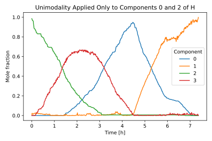
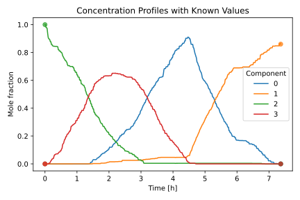

Advanced Topics
===============
This section explores advanced usage patterns in McrNmf, including handling conflicting
constraints, selectively applying unimodality, and incorporating known concentration
values during model fitting. All examples assume a starting point consistent with the
basic workflow, using :class:`~mcrnmf.models.SNPA` for initial estimates, and refining
with the :class:`~mcrnmf.models.MinVol` model.

Begin by importing the dataset and generating initial estimates using
:class:`~mcrnmf.models.SNPA`, as shown in the :doc:`workflow`.

.. code-block:: python

    import matplotlib.pyplot as plt
    from mcrnmf import MinVol, SNPA
    from mcrnmf.datasets import load_rxn_spectra

    X, wv, time = load_rxn_spectra()

    num_components = 4

    snpa = SNPA(rank=num_components, iter_max=1000)
    snpa.fit(X=X)

    Wi = snpa.W.copy()
    Hi = snpa.H.copy()

Handling Conflicting Constraints: *Unimodality vs. Closure*
-----------------------------------------------------------
When working with multiple constraints, be aware that some combinations may not be fully
satisfied simultaneously, particularly when combining ``constraint_kind=4`` (strict closure:
concentrations sum to 1 at each time point) with unimodality constraints on :math:`H`.

Consider the following example using the included dataset:

.. code-block:: python

    # Apply both column sum=1 constraint and unimodality
    mvol_incompatible = MinVol(
        rank=num_components,
        constraint_kind=4,  # Sum of concentrations at each timepoint = 1
        unimodal={"H": True},  # All concentration profiles should be unimodal
        lambdaa=1e-4,
        iter_max=2000,
    )

    # Fit the model with potentially incompatible constraints
    mvol_incompatible.fit(X=X, Wi=Wi, Hi=Hi)

    # Visualize the results
    fig, ax = plt.subplots(figsize=(6, 4))
    ax.plot(time, mvol_incompatible.H.T)
    ax.legend([f"{i}" for i in range(num_components)], title="Component")
    ax.set_xlabel("Time [h]")
    ax.set_ylabel("Mole fraction")
    ax.set_title("Concentration Profiles with Conflicting Constraints")

    # Check if columns sum to 1 exactly
    column_sums = mvol_incompatible.H.sum(axis=0)
    print(f"All columns sum to 1: {np.allclose(column_sums, 1.0)}")

    def is_unimodal(arr_1d):
        """Verifies that the array has at most one peak"""
        increasing = False
        decreasing = False
        for i in range(1, arr_1d.size):
            if arr_1d[i] > arr_1d[i - 1]:
                increasing = True
                if decreasing:
                    return False
            elif arr_1d[i] < arr_1d[i - 1]:
                decreasing = True
        return True

    unimodal_status = []
    for i in range(mvol_incompatible.H.shape[0]):
        unimodal_status.append(is_unimodal(mvol_incompatible.H[i, :]))
    print(
        f"Unimodality satisfied: {sum(unimodal_status)}/{len(unimodal_status)} components"
    )
    fig.tight_layout()
    plt.show()

.. figure:: ../_static/figures/constraints_conflict.svg
    :align: center
    :alt: Constraints compatibility issues
    :width: 80%

.. note::
   **Limitation**: When using ``constraint_kind=4`` (column sum = 1) together with
   unimodality constraints, both constraints may not be perfectly satisfied
   simultaneously.

   **Why this happens**: These constraints are applied sequentially in the algorithm:

   1. Unimodality modifies each row to follow a single-peak pattern
   2. Column normalization scales values to maintain sum = 1

   When one constraint is enforced, it may disturb the other constraint that was
   previously satisfied. The algorithm prioritizes the ``constraint_kind`` parameter,
   so the column sum constraint will generally be more precisely maintained than
   unimodality.

   **Recommendation**:

   * Prefer ``constraint_kind=1`` (sum :math:`\leq` 1) when applying unimodality, as it
     offers more flexibility and avoids mutual interference between the constraints.

Component-Specific Unimodal Constraints
---------------------------------------
You can apply constraints selectively to different components. For example, only certain
components of :math:`H` may need unimodality constraints:

.. code-block:: python

    # Apply unimodal constraints only to components 0 and 2
    mvol_uni_some = MinVol(
        rank=num_components,
        constraint_kind=1,
        unimodal={"H": [True, False, True, False]},
        lambdaa=1e-4,
        iter_max=2000,
    )

    # Fit the model with selective constraints
    mvol_uni_some.fit(X=X, Wi=Wi, Hi=Hi)

    fig, ax = plt.subplots(figsize=(6, 4))
    ax.plot(time, mvol_uni_some.H.T)
    ax.legend([f"{i}" for i in range(num_components)], title="Component")
    ax.set_xlabel("Time [h]")
    ax.set_ylabel("Mole fraction")
    ax.set_title("Unimodality Applied Only to Components 0 and 2 of H")
    fig.tight_layout()
    plt.show()

Incorporating Known Concentration Measurements
----------------------------------------------
If you have measured concentration values for certain components at specific timepoints,
you can incorporate this information into the model fitting using the ``known_H`` parameter.

The example below builds on the same setup from earlier, using initial estimates from
:class:`~mcrnmf.models.SNPA` and refining the decomposition with the
:class:`~mcrnmf.models.MinVol` model.

.. code-block:: python

    num_timepoints = time.size
    known_H = np.full((num_components, num_timepoints), np.nan)

    # suppose you know the concentrations at first time point
    known_H[:, 0] = [0, 0, 1, 0]
    # suppose you also know the concentrations at the last time point
    known_H[:, -1] = [0, 0.86, 0, 0]

    mvol_known = MinVol(
        rank=num_components,
        constraint_kind=1,
        unimodal={"H": True},
        lambdaa=1e-4,
        iter_max=2000,
    )

    # the known H value information is provided here
    mvol_known.fit(X=X, Wi=Wi, Hi=Hi, known_H=known_H)

    # visualize the results
    fig, ax = plt.subplots(figsize=(6, 4))
    ax.plot(time, mvol_known.H.T)
    ax.legend([f"{i}" for i in range(num_components)], title="Component")

    # add the known values
    for i in range(num_components):
        known_indices = np.where(~np.isnan(known_H[i, :]))[0]
        ax.scatter(time[known_indices], known_H[i, known_indices], marker="o", alpha=0.7)
    ax.set_xlabel("Time [h]")
    ax.set_ylabel("Mole fraction")
    ax.set_title("Concentration Profiles with Known Values")
    fig.tight_layout()
    plt.show()

These techniques work similarly across all McrNmf models that support constraints,
including :class:`~mcrnmf.models.FroALS` and :class:`~mcrnmf.models.FroFPGM`