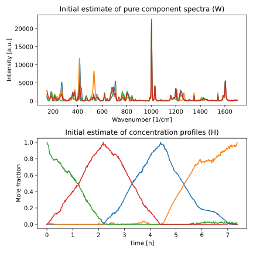
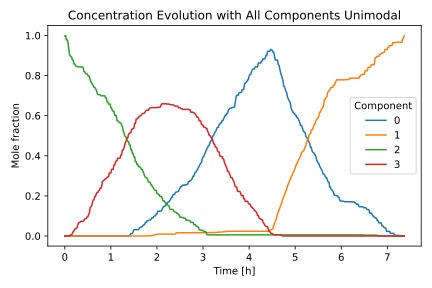
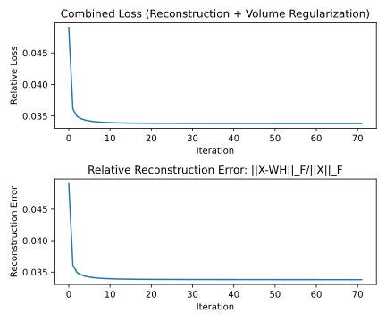

Basic Workflow: From Data to Decomposition
==========================================

Example Reaction Spectroscopy Dataset
-------------------------------------
Let's demonstrate the API using a real-world reaction spectroscopy dataset included with
the package:

.. code-block:: python

    import matplotlib.pyplot as plt
    from matplotlib.colors import Normalize

    # for loading the dataset
    from mcrnmf.datasets import load_rxn_spectra

    # import all necessary algorithms
    from mcrnmf import MinVol, SNPA

    # Load Raman spectroscopy data from a chemical reaction
    # X: spectral data matrix (wavenumber × time points)
    # wv: wavenumber values (x-axis for spectra)
    # time: time points of the reaction (in hours)
    X, wv, time = load_rxn_spectra()

    # Visualization of spectral data colored by time
    norm = Normalize(vmin=time[0], vmax=time[-1])
    fig, ax = plt.subplots(figsize=(6, 3))
    for i in range(X.shape[1]):
        ax.plot(wv, X[:, i], color=plt.cm.viridis(norm(time[i])), linewidth=0.75)
    ax.set_xlabel("Raman shift [1/cm]")
    ax.set_ylabel("Intensity [a.u.]")
    cbar = plt.colorbar(
        mappable=plt.cm.ScalarMappable(cmap=plt.cm.viridis, norm=norm), ax=ax
    )
    cbar.set_label("Time [hr]")
    plt.show()

.. figure:: ../_static/figures/time_series_spectra.svg
    :align: center
    :alt: Time series of Raman spectra
    :width: 80%

Raman spectra colored by reaction time. Each line represents one spectrum at a specific
time point. Changes in the spectra over time indicate chemical transformations.

Workflow Overview
-----------------
A typical MCR-NMF workflow consists of:

1. **Initial estimation** of :math:`W` and :math:`H` matrices using :class:`~mcrnmf.models.SNPA`
2. **Refinement** of these estimates using algorithms like :class:`~mcrnmf.models.MinVol`,
   :class:`~mcrnmf.models.FroALS`, or :class:`~mcrnmf.models.FroALS`
3. **Analysis** of the resulting component spectra and concentration profiles

.. note::

   While the example below demonstrates :class:`~mcrnmf.models.SNPA`, the same workflow
   initialization with :class:`~mcrnmf.models.SNPA`, followed by fitting and evaluation
   also applies to :class:`~mcrnmf.models.FroALS` and :class:`~mcrnmf.models.FroFPGM`. We
   use :class:`~mcrnmf.models.MinVol` here because, in our experience, it often produces
   the best results on real-world datasets.

Initializing Component Estimates with :class:`~mcrnmf.models.SNPA`
------------------------------------------------------------------
Successive Nonnegative Projection Algorithm (SNPA) provides good initial values for
:math:`W` and :math:`H` matrices. Here is an example of how you could use it.

.. code-block:: python

    # Choose the number of chemical components to extract
    num_components = 4

    # Initialize and run SNPA algorithm
    # SNPA identifies vertices in the data cloud that likely represent pure components
    snpa = SNPA(rank=num_components, iter_max=1000)
    snpa.fit(X=X)

    # Get the initial estimates
    Wi = snpa.W.copy()  # Initial estimate for component spectra
    Hi = snpa.H.copy()  # Initial estimate for concentration profiles

    # Visualization of the initial estimates
    fig, axs = plt.subplots(nrows=2, ncols=1, figsize=(6, 4))
    axs[0].plot(wv, Wi)
    axs[0].set_xlabel("Wavenumber [1/cm]")
    axs[0].set_ylabel("Intensity [a.u.]")
    axs[0].set_title("Initial estimate of pure component spectra (W)")
    axs[1].plot(time, Hi.T)
    axs[1].set_xlabel("Time [h]")
    axs[1].set_ylabel("Mole fraction")
    axs[1].set_title("Initial estimate of concentration profiles (H)")
    fig.tight_layout()
    plt.show()

Refining Spectral Decomposition with :class:`~mcrnmf.models.MinVol`
-------------------------------------------------------------------
Create an instance of :class:`~mcrnmf.models.MinVol` and fit the model to the data.

.. code-block:: python

    # Create a MinVol instance with constraints
    mvol_uni_all = MinVol(
        rank=num_components,
        constraint_kind=1,  # Sum of concentrations at each timepoint ≤ 1
        unimodal={"H": True},  # All concentration profiles should be unimodal
        lambdaa=1e-4,  # Regularization parameter controlling the simplex volume
        iter_max=2000,  # Maximum number of iterations
    )

    # Fit the MinVol model using initial estimates from SNPA
    mvol_uni_all.fit(X=X, Wi=Wi, Hi=Hi)

    # Visualize the refined concentration profiles
    fig, ax = plt.subplots(figsize=(6, 4))
    ax.plot(time, mvol_uni_all.H.T) # 'H' result accessed from the property `H`
    ax.legend([f"{i}" for i in range(num_components)], title="Component")
    ax.set_xlabel("Time [h]")
    ax.set_ylabel("Mole fraction")
    ax.set_title("Concentration Evolution with All Components Unimodal")
    fig.tight_layout()
    plt.show()

Evaluating Algorithm Convergence and Fit Quality
------------------------------------------------
After fitting a model, you can evaluate its convergence and performance using several
properties. The :class:`~mcrnmf.models.MinVol` algorithm provides three properties for
evaluating results:

- ``is_converged``: Boolean indicating whether the algorithm reached convergence based
  on the tolerance criteria. If ``False``, you might consider increasing ``iter_max``.

- ``rel_loss_ls``: List of relative loss values at each iteration, combining both
  reconstruction error and volume regularization terms. This shows the overall
  optimization progress.

- ``rel_reconstruction_error_ls``: List of just the relative reconstruction error component
  :math:`\dfrac{||X-WH||_F}{||X||_F}` at each iteration. This measures how well your
  factorization approximates the original data.

We now examine the convergence behavior of the previously fitted :class:`~mcrnmf.models.MinVol`
model.

.. code-block:: python

    # Check if the algorithm converged within the maximum iterations
    converged = mvol_uni_all.is_converged
    print(f"Did the algorithm converge? {converged}")

    fig, axs = plt.subplots(nrows=2, ncols=1, figsize=(6, 5))

    # Plot the overall loss (includes both reconstruction error and ...
    # volume regularization term)
    axs[0].plot(mvol_uni_all.rel_loss_ls) # property containing relative loss
    axs[0].set_xlabel("Iteration")
    axs[0].set_ylabel("Relative Loss")
    axs[0].set_title("Combined Loss (Reconstruction + Volume Regularization)")

    # Plot just the reconstruction error
    # property containing the relative reconstruction error
    axs[1].plot(mvol_uni_all.rel_reconstruction_error_ls)
    axs[1].set_xlabel("Iteration")
    axs[1].set_ylabel("Reconstruction Error")
    axs[1].set_title("Relative Reconstruction Error: ||X-WH||_F/||X||_F")

    fig.tight_layout()
    plt.show()

    # Get the final reconstruction error
    final_error = mvol_uni_all.rel_reconstruction_error_ls[-1]
    print(f"Final relative reconstruction error: {final_error:.6f}")

.. note::
   * For :class:`~mcrnmf.models.FroALS` and :class:`~mcrnmf.models.FroFPGM`,
     ``rel_loss_ls`` and ``rel_reconstruction_error_ls`` are identical because these
     algorithms optimize only the reconstruction error :math:`||X-WH||_F^2`.

   * For :class:`~mcrnmf.models.MinVol`, these properties differ because it optimizes a
     combined objective: :math:`||X-WH||_F^2 + \lambda \times \log(\det(W^T W + \delta I)),`